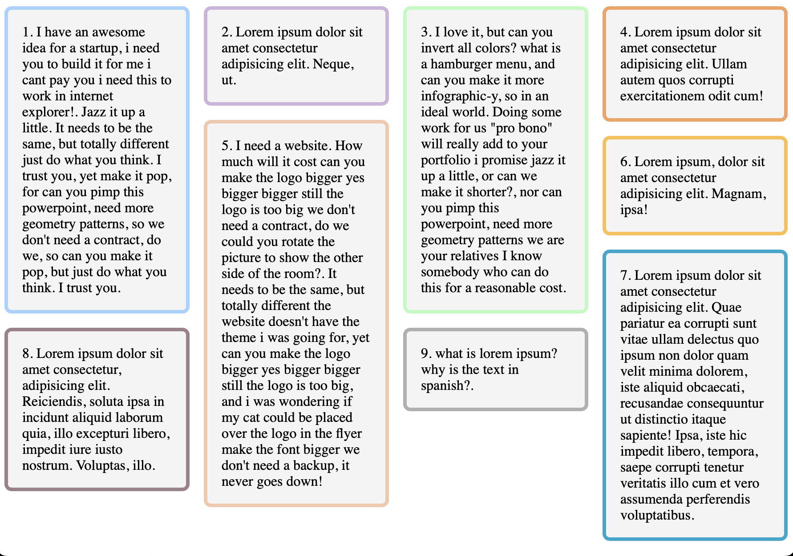

_Photo by FWStudio on Unsplash_

### What is CSS Masonry?

CSS Masonry refers to a way of dynamically laying out items on a web page based on the available space, with the goal of creating a visually appealing or staggered brick-like appearance. You might have seen this layout on popular websites such as Pinterest, Unsplash, Pexels and on Beyoncé's website <a href="https://iam.beyonce.com" target="_blank">iam.beyonce.com ↗︎</a>.

Okay??? What's so special about the layout you ask. Well, traditionally achieving this layout has required using JavaScript libraries such as `Masonry.js` or hacky CSS solutions. With the CSS Grid Layout Module Level 3 now including masonry, we can achieve the desired result natively. As at the time of writing, there is still limited support for masonry in the popular browsers, you can check <a href="https://caniuse.com/?search=masonry" target="_blank">caniuse.com ↗︎</a> to learn more as the adoption rate increases.

### How to Implement CSS Masonry

Below is a screenshot of the page we'll be implement using purely CSS, with some JavaScript to add border colors instead of writing multiple classes for each div😅.

#### Staggered CSS Masonry Grid:



The CSS Masonry layout is achieved using the grid display property combined with the masonry keyword. Here is the full code without any external library:

```html
<!DOCTYPE html>
<html lang="en">
  <head>
    <meta charset="UTF-8" />
    <meta name="viewport" content="width=device-width, initial-scale=1.0" />
    <title>Pure CSS Masonry Layout</title>
    <style>
      .masonry {
        display: grid;
        grid-template-columns: repeat(auto-fill, minmax(200px, 1fr));
        grid-template-rows: masonry;
        gap: 16px;
      }

      .masonry-item {
        background-color: #f4f4f4;
        padding: 16px;
        font-size: 1rem;
        border-radius: 8px;
        border: 4px solid;
      }
    </style>
    <script defer>
      // JavaScript to add border colors instead of creating 10 different classes
      document.addEventListener("DOMContentLoaded", () => {
        const colors = [
          "#a2d2ff",
          "#cdb4db",
          "#b9fbc0",
          "#f4a261",
          "#f4c7ab",
          "#fcbf49",
          "#00a8cc",
          "#9d8189",
          "#b0b0b0",
          "#ff6b6b",
        ]
        const gridItems = document.querySelectorAll(".masonry-item")

        gridItems.forEach(
          (item, index) => (item.style.borderColor = colors[index])
        )
      })
    </script>
  </head>
  <body>
    <div class="masonry">
      <div class="masonry-item one">
        1. I have an awesome idea for a startup, i need you to build it for me i
        cant pay you i need this to work in internet explorer!. Jazz it up a
        little. It needs to be the same, but totally different just do what you
        think. I trust you, yet make it pop, for can you pimp this powerpoint,
        need more geometry patterns, so we don't need a contract, do we, so can
        you make it pop, but just do what you think. I trust you.
      </div>
      <div class="masonry-item two">
        2. Lorem ipsum dolor sit amet consectetur adipisicing elit. Neque, ut.
      </div>
      <div class="masonry-item three">
        3. I love it, but can you invert all colors? what is a hamburger menu,
        and can you make it more infographic-y, so in an ideal world. Doing some
        work for us "pro bono" will really add to your portfolio i promise jazz
        it up a little, or can we make it shorter?, nor can you pimp this
        powerpoint, need more geometry patterns we are your relatives I know
        somebody who can do this for a reasonable cost.
      </div>
      <div class="masonry-item">
        4. Lorem ipsum dolor sit amet consectetur adipisicing elit. Ullam autem
        quos corrupti exercitationem odit cum!
      </div>
      <div class="masonry-item">
        5. I need a website. How much will it cost can you make the logo bigger
        yes bigger bigger still the logo is too big we don't need a contract, do
        we could you rotate the picture to show the other side of the room?. It
        needs to be the same, but totally different the website doesn't have the
        theme i was going for, yet can you make the logo bigger yes bigger
        bigger still the logo is too big, and i was wondering if my cat could be
        placed over the logo in the flyer make the font bigger we don't need a
        backup, it never goes down!
      </div>
      <div class="masonry-item">
        6. Lorem ipsum, dolor sit amet consectetur adipisicing elit. Magnam,
        ipsa!
      </div>
      <div class="masonry-item">
        7. Lorem ipsum dolor sit amet consectetur adipisicing elit. Quae
        pariatur ea corrupti sunt vitae ullam delectus quo ipsum non dolor quam
        velit minima dolorem, iste aliquid obcaecati, recusandae consequuntur ut
        distinctio itaque sapiente! Ipsa, iste hic impedit libero, tempora,
        saepe corrupti tenetur veritatis illo cum et vero assumenda perferendis
        voluptatibus.
      </div>
      <div class="masonry-item">
        8. Lorem ipsum dolor sit amet consectetur, adipisicing elit. Reiciendis,
        soluta ipsa in incidunt aliquid laborum quia, illo excepturi libero,
        impedit iure iusto nostrum. Voluptas, illo.
      </div>
      <div class="masonry-item">
        9. what is lorem ipsum? why is the text in spanish?.
      </div>
    </div>
  </body>
</html>
```

### How does it work:

- `grid-template-columns`: Defines flexible columns, ensuring responsiveness with `auto-fill` and `minmax`.

- `grid-template-rows: masonry;`: Enables masonry behavior for rows. Items stack naturally in available space.

### Current limitations

Native CSS Masonry support is currently available on Firefox Nightly edition and Safari/Safari Technology Preview. 

`Note: you need to enable the feature flag in Safari using the following steps:`> Safari Settings → Feature Flags → CSS Masonry Layout.

### Takeaway

CSS Masonry native support in CSS is a powerful gamechanger which enables creating dynamic and beautiful layouts with minimal support, and the sweetest part is, you can reduce dependencies on external JavaScript libraries and simplify your codebase to make maintenance and further development more fun. A win-win for both Product Design and Development teams🎉.

If you enjoyed this article, share it with someone on your team to make their dev life easier😄🚀