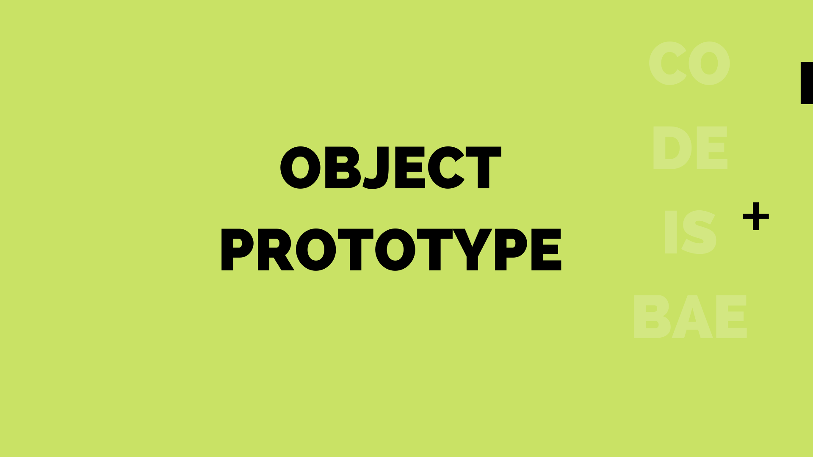

How to Set and Access Object Prototype

In the post on [Prototypal Inheritance](/prototypal-inheritance/), we looked at inheritance in JavaScript. In this post, we would be taking a look at the way to create an object and access prototypes as recommended in the ECMAScript 2015 standard.

### Object Prototype Methods
- <a href="https://developer.mozilla.org/en-US/docs/Web/JavaScript/Reference/Global_Objects/Object/create" target="_blank" rel="nofollow">Object.create(proto, [propertiesObject]) ↗︎</a> - creates a new object, using an existing object as the prototype of the newly created object.
- <a href="https://developer.mozilla.org/en-US/docs/Web/JavaScript/Reference/Global_Objects/Object/getPrototypeOf" target="_blank" rel="nofollow">Object.getPrototypeOf(obj) ↗︎</a> - returns the prototype (i.e. the value of the internal [[Prototype]] property) of the specified object
- <a href="https://developer.mozilla.org/en-US/docs/Web/JavaScript/Reference/Global_Objects/Object/setPrototypeOf" target="_blank" rel="nofollow">Object.setPrototypeOf(obj, prototype) ↗︎</a> - method sets the prototype (i.e., the internal [[Prototype]] property) of a specified object to another object or null.

_Note_: _`__proto__` is not the standard way to access or assign the prototype of an object. It is still supported by most modern browsers for compartibility reasons._

### How to Create an Object Prototype
There are a couple of ways to create an object in JavaScript but we would focus on the approach that gives us more control to set the prototype the way we intend. For this reason, we would use `Object.create` to create objects and pass in the desired prototype as shown below:
```js
// create a base object
let Vehicle = {
  hasWheels: true,
}

// create a new object with 'Vehicle' as its prototype using
// Object.create(proto, [propertiesObject])
let Tesla = Object.create(Vehicle, {
  summon: {
    value: true
  }
});

/*
  'propertiesObject' follows the format:
  {
    "value": "whatever",
    "writable": true,
    "enumerable": true,
    "configurable": true
  }
*/

// check property available in parent of newly created object
console.log(Tesla.hasWheels) // true
```

Creating the object `Tesla` with `Vehicle` as the prototype gives us the advantage of accessing properties in the base object (Vehicle) but not available in the new object (Tesla); This is closely related to the post on [Prototypal Inheritance](/prototypal-inheritance/) because it allows us inherit properties of the parent/base object without re-creating them from scratch.

_Note_: we could use the `Object.create` method to create a shallow copy of an object like so:
```js
let TeslaClone = Object.create(Object.getPrototypeOf(Tesla), Object.getOwnPropertyDescriptors(Tesla));
```

### How to Access the Prototype of an Object

**Object.getPrototypeOf(obj)**

To return the prototype of an object or to check if the prototype of a specific object is equal to another, the `getPrototypeOf` method is used like so:
```js
let user = {
  name: "john doe"
}
let userObj = Object.create(user);

// check prototype
console.log(Object.getPrototypeOf(userObj) === user); // returns true
```

### How to Set the Prototype of an Object
**Object.setPrototypeOf(obj, prototype)**

The `setPrototypeOf` method is used to set the prototype of a given object to another object or null. Something to be aware of when using this method in production is that it is a very slow operation, that means you might want to use it as a last resort when possible.

Taking the `user` object above a step further, we could decide to set the prototype to an empty object.

```js
Object.setPrototypeOf(user, {}); // prototype becomes {}
```

_credits_: <a href="https://developer.mozilla.org/en-US/" target="_blank" rel="nofollow">MDN ↗︎</a>