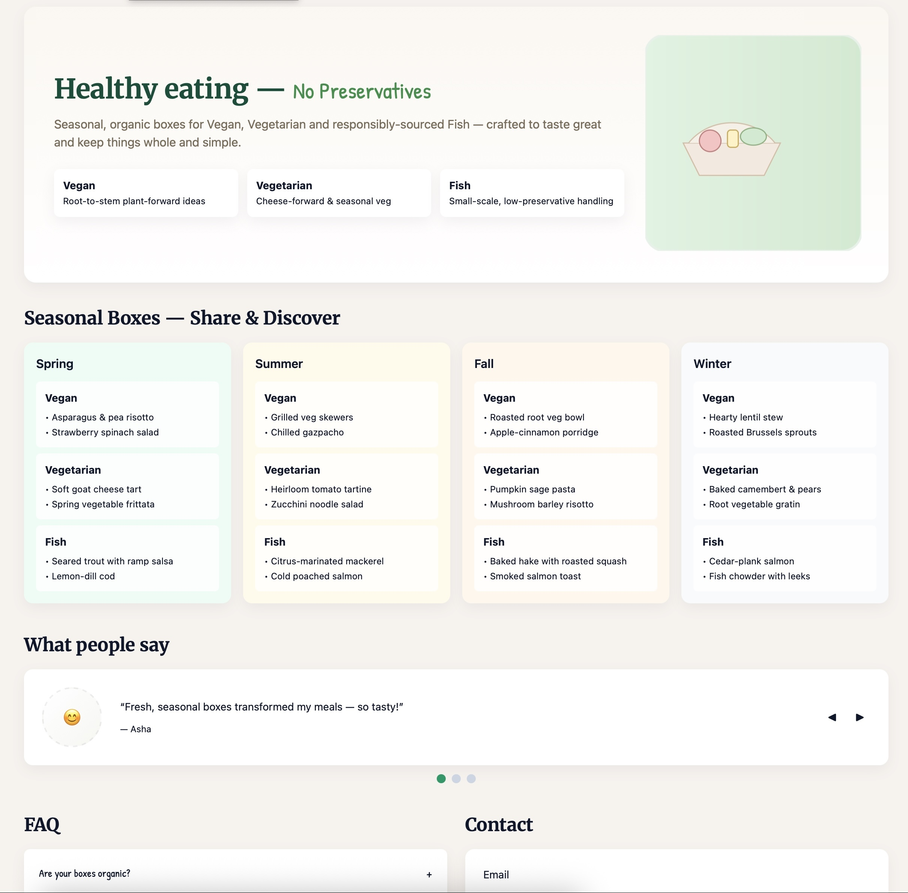

## OpenAI GPT‑5

The heat of Artificial Intelligence as productivity boosters keeps getting even hotter. A few days ago, on August 7th to be precise, OpenAI released the latest various of their AI model named GPT-5. Based on the benchmark tests they conducted and which are referenced in the accompanying blog post (https://openai.com/index/introducing-gpt-5), the model is a substantial leap in the progress made by GPT‑4o and earlier models. OpenAI describe it in the following way:

> GPT‑5 is a unified system with a smart, efficient model that answers most questions, a deeper reasoning model (GPT‑5 thinking) for harder problems, and a real‑time router that quickly decides which to use based on conversation type, complexity, tool needs, and your explicit intent 

## Putting it to the test

I couldn’t resist putting it to the test, so I decided to get my hands dirty with it and tried using it to generate a an organic healthy-eating program. The aim was to test out how well the model would translate the requirements I gave it and see what the final product would be. 

Below is the prompt I gave the model:

> Title: Healthy eating — No preservative foods Landing 
>
> Prompt: Create a single-page app, in a single HTML file, for an organic healthy eating program with a hand-drawn, greencolor aesthetic. Visuals: paper texture background, warm serif headings, muted earth-tone palette; gentle parallax on illustrations.  
>
> Hero: Vegan, Vegetarian, Fish seasonal basket illustration, short pitch
>
> Share: grid of seasonal boxes (Spring/Summer/Fall/Winter) for Vegan, Vegetarian and Fish food ideas  Testimonials: card carousel with smiley portraits. FAQ + Contact: accordion with smooth open/close; simple email form; accessibility and keyboard support; fully responsive. 

The above prompt was inspired by one of the examples listed on the OpenAI gallery which can be found here - https://platform.openai.com/docs/guides/latest-model?gallery=open&galleryItem=artisan-csa

The model thought for about 6 seconds and start generating the code which took about another minute and below is a screenshot of the final result:



## My Takeaways

Whether you want to quickly prototype an idea or collaborate on more complex projects, GPT-5 promises to enable you accomplish more with less. The example above, is understandable a small project done in a few minutes over the weekend but it gives an idea of the potential and immense importance the new model can have for teams or startups who might be on a small budget but working on getting their product out to the market in the shortest possible time.


**The generated code is available below:**

```
/*
Single-file React component for: "Healthy eating — No preservative foods"
- Designed with a hand-drawn, green color aesthetic
- Paper texture background, warm serif headings, muted earth-tone palette
- Gentle parallax on illustrations, seasonal share grid, testimonial carousel,
  accessible accordion FAQ, contact form with keyboard support

Usage:
- This is a single React component (default export). Drop into a React app (Vite/CRA/Next) and render <App />.
- The styling uses Tailwind utility classes; Tailwind is assumed available in the host project.
- Google Fonts are imported at the top of the component via a style tag.
*/

import React, { useEffect, useRef, useState } from "react";

export default function App() {
  // Testimonials carousel state
  const [idx, setIdx] = useState(0);
  const testimonials = [
    { name: "Asha", text: "Fresh, seasonal boxes transformed my meals — so tasty!", emoji: "😊" },
    { name: "Marco", text: "Love the fish boxes — the tips for storage were gold.", emoji: "😄" },
    { name: "Lena", text: "Beautifully designed program and great recipes.", emoji: "🙂" },
  ];

  // Auto-advance testimonials
  useEffect(() => {
    const t = setInterval(() => setIdx((i) => (i + 1) % testimonials.length), 6000);
    return () => clearInterval(t);
  }, []);

  // Accordion state
  const [openIdx, setOpenIdx] = useState(null);
  const toggleAccordion = (i) => setOpenIdx(openIdx === i ? null : i);

  // Parallax effect
  const parallaxRef = useRef(null);
  useEffect(() => {
    const el = parallaxRef.current;
    if (!el) return;
    const onMove = (e) => {
      const x = (e.clientX / window.innerWidth - 0.5) * 12;
      const y = (e.clientY / window.innerHeight - 0.5) * 8;
      el.style.transform = `translate(${x}px, ${y}px)`;
    };
    window.addEventListener("mousemove", onMove);
    return () => window.removeEventListener("mousemove", onMove);
  }, []);

  // Accessibility: handle arrow keys for testimonial carousel
  useEffect(() => {
    const onKey = (e) => {
      if (e.key === "ArrowRight") setIdx((i) => (i + 1) % testimonials.length);
      if (e.key === "ArrowLeft") setIdx((i) => (i - 1 + testimonials.length) % testimonials.length);
    };
    window.addEventListener("keydown", onKey);
    return () => window.removeEventListener("keydown", onKey);
  }, []);

  const seasons = [
    {
      name: "Spring",
      color: "bg-emerald-50",
      ideas: {
        Vegan: ["Asparagus & pea risotto", "Strawberry spinach salad"],
        Vegetarian: ["Soft goat cheese tart", "Spring vegetable frittata"],
        Fish: ["Seared trout with ramp salsa", "Lemon-dill cod"],
      },
    },
    {
      name: "Summer",
      color: "bg-amber-50",
      ideas: {
        Vegan: ["Grilled veg skewers", "Chilled gazpacho"],
        Vegetarian: ["Heirloom tomato tartine", "Zucchini noodle salad"],
        Fish: ["Citrus-marinated mackerel", "Cold poached salmon"],
      },
    },
    {
      name: "Fall",
      color: "bg-orange-50",
      ideas: {
        Vegan: ["Roasted root veg bowl", "Apple-cinnamon porridge"],
        Vegetarian: ["Pumpkin sage pasta", "Mushroom barley risotto"],
        Fish: ["Baked hake with roasted squash", "Smoked salmon toast"],
      },
    },
    {
      name: "Winter",
      color: "bg-slate-50",
      ideas: {
        Vegan: ["Hearty lentil stew", "Roasted Brussels sprouts"],
        Vegetarian: ["Baked camembert & pears", "Root vegetable gratin"],
        Fish: ["Cedar-plank salmon", "Fish chowder with leeks"],
      },
    },
  ];

  return (
    <div className="min-h-screen text-slate-900 p-6 md:p-12 font-sans" style={{ background: "#f6f3ee" }}>
      {/* Fonts + small CSS reset inside component for single-file portability */}
      <style>{`
        @import url('https://fonts.googleapis.com/css2?family=Merriweather:wght@700;900&family=Patrick+Hand&display=swap');
        :root{--accent:#2f8f4b;--paper:#fbf7f1;--muted:#7a6b58}
        .paper-texture{background-image: radial-gradient(rgba(0,0,0,0.02) 1px, transparent 1px); background-size: 10px 10px;}
        .hand-drawn{font-family: 'Patrick Hand', system-ui, -apple-system, 'Segoe UI', Roboto, 'Helvetica Neue', Arial}
        .serif-head{font-family: 'Merriweather', Georgia, serif}
        /* Gentle shadowing for cards to feel tactile */
        .tactile{box-shadow: 0 6px 18px rgba(16,24,40,0.06)}
        /* accessible focus ring */
        :focus{outline:none}
        .focus-ring:focus{box-shadow: 0 0 0 3px rgba(47,143,75,0.18)}
        /* Smooth accordion transitions */
        .accordion-content{transition: height 280ms cubic-bezier(.2,.9,.3,1), opacity 220ms}
        /* testimonial portrait circle hand-drawn sketch */
        .sketch-circle{background: linear-gradient(135deg, rgba(255,255,255,0.7), rgba(245,245,240,0.9)); border: 2px dashed rgba(0,0,0,0.06);}
      `}</style>

      <div className="max-w-6xl mx-auto">
        {/* HERO */}
        <header className="paper-texture rounded-2xl p-6 md:p-10 mb-8 tactile" style={{ background: "linear-gradient(180deg,var(--paper),#fff)" }}>
          <div className="flex flex-col md:flex-row items-center gap-6">
            <div className="flex-1">
              <h1 className="serif-head text-3xl md:text-4xl leading-tight text-emerald-900">
                Healthy eating — <span className="hand-drawn text-2xl md:text-3xl" style={{ color: "var(--accent)" }}>No Preservatives</span>
              </h1>
              <p className="mt-3 text-muted text-sm md:text-base text-muted-600" style={{ color: "var(--muted)" }}>
                Seasonal, organic boxes for Vegan, Vegetarian and responsibly-sourced Fish — crafted to taste great and keep things whole and simple.
              </p>

              <ul className="mt-6 grid grid-cols-1 sm:grid-cols-3 gap-3 text-sm">
                <li className="rounded-lg p-3 bg-white tactile focus-ring" tabIndex={0} aria-hidden>
                  <strong className="block">Vegan</strong>
                  <span className="text-xs text-muted">Root-to-stem plant-forward ideas</span>
                </li>
                <li className="rounded-lg p-3 bg-white tactile focus-ring" tabIndex={0} aria-hidden>
                  <strong className="block">Vegetarian</strong>
                  <span className="text-xs text-muted">Cheese-forward & seasonal veg</span>
                </li>
                <li className="rounded-lg p-3 bg-white tactile focus-ring" tabIndex={0} aria-hidden>
                  <strong className="block">Fish</strong>
                  <span className="text-xs text-muted">Small-scale, low-preservative handling</span>
                </li>
              </ul>
            </div>

            {/* Illustrative seasonal basket - simple hand-drawn SVG with parallax */}
            <div className="w-56 h-56 md:w-72 md:h-72 relative" aria-hidden>
              <div ref={parallaxRef} className="absolute inset-0 transform transition-transform duration-300" style={{ willChange: 'transform' }}>
                <svg viewBox="0 0 200 200" className="w-full h-full">
                  <defs>
                    <linearGradient id="g" x1="0" x2="1">
                      <stop offset="0" stopColor="#dff3e2" />
                      <stop offset="1" stopColor="#cfead0" />
                    </linearGradient>
                  </defs>
                  <rect x="0" y="0" width="200" height="200" rx="18" fill="url(#g)" stroke="#e6f1e8" strokeWidth="2" />
                  {/* basket */}
                  <g transform="translate(30,70)">
                    <path d="M20 60 L80 60 L95 30 L5 30 Z" fill="#f4e9df" stroke="#d6bca3" />
                    <path d="M10 30 C30 5,70 5,90 30" fill="#f6f0e6" stroke="#d6bca3" />
                    {/* produce */}
                    <circle cx="30" cy="28" r="10" fill="#f9c3c3" stroke="#c47a7a" />
                    <ellipse cx="70" cy="24" rx="12" ry="8" fill="#cfead0" stroke="#84b07b" />
                    <rect x="46" y="18" width="10" height="16" rx="3" fill="#fff3c3" stroke="#caa84a" />
                  </g>
                </svg>
              </div>
            </div>
          </div>
        </header>

        {/* SHARE: Seasonal grid */}
        <section aria-labelledby="share-heading" className="mb-10">
          <h2 id="share-heading" className="serif-head text-2xl mb-4">Seasonal Boxes — Share & Discover</h2>
          <div className="grid gap-4 md:grid-cols-4">
            {seasons.map((s, i) => (
              <article key={s.name} className={`rounded-xl p-4 ${s.color} tactile`}>
                <h3 className="font-semibold">{s.name}</h3>
                <div className="mt-3 grid gap-2">
                  {Object.entries(s.ideas).map(([type, items]) => (
                    <div key={type} className="rounded-md p-3 bg-white/80">
                      <strong className="block text-sm">{type}</strong>
                      <ul className="mt-2 text-xs space-y-1">
                        {items.map((it) => <li key={it} className="leading-snug">• {it}</li>)}
                      </ul>
                    </div>
                  ))}
                </div>
              </article>
            ))}
          </div>
        </section>

        {/* Testimonials carousel */}
        <section aria-labelledby="testimonials-heading" className="mb-10">
          <h2 id="testimonials-heading" className="serif-head text-2xl mb-4">What people say</h2>
          <div className="relative">
            <div className="bg-white rounded-xl p-6 tactile flex items-center gap-6">
              <div className="w-20 h-20 flex-shrink-0 sketch-circle rounded-full flex items-center justify-center text-2xl select-none" aria-hidden>
                {testimonials[idx].emoji}
              </div>
              <blockquote className="flex-1">
                <p className="text-sm">“{testimonials[idx].text}”</p>
                <footer className="mt-3 text-xs text-muted">— {testimonials[idx].name}</footer>
              </blockquote>

              <div className="flex items-center gap-2">
                <button aria-label="Previous testimonial" className="p-2 rounded focus-ring" onClick={() => setIdx((i) => (i - 1 + testimonials.length) % testimonials.length)}>◀</button>
                <button aria-label="Next testimonial" className="p-2 rounded focus-ring" onClick={() => setIdx((i) => (i + 1) % testimonials.length)}>▶</button>
              </div>
            </div>
            {/* dots */}
            <div className="flex gap-2 mt-3 justify-center">
              {testimonials.map((t, i) => (
                <button key={t.name} aria-label={`Go to ${t.name}`} onClick={() => setIdx(i)} className={`w-3 h-3 rounded-full ${i === idx ? 'bg-emerald-600' : 'bg-slate-300'}`} />
              ))}
            </div>
          </div>
        </section>

        {/* FAQ + Contact */}
        <section aria-labelledby="faq-heading" className="mb-12 grid gap-6 md:grid-cols-2">
          <div>
            <h2 id="faq-heading" className="serif-head text-2xl mb-4">FAQ</h2>
            <div className="space-y-3">
              {[
                { q: "Are your boxes organic?", a: "Yes — we partner with certified organic small producers where possible, and clearly label each ingredient." },
                { q: "How long can I store fish?", a: "Follow the included care card: consume within 48–72 hours for best quality, freeze if longer." },
                { q: "Can I change my box each week?", a: "Absolutely — flexible subscriptions let you swap categories or pause anytime." },
              ].map((item, i) => (
                <div key={i} className="bg-white rounded-lg p-2 tactile">
                  <button
                    className="w-full text-left py-3 px-3 focus-ring rounded-md hand-drawn"
                    aria-expanded={openIdx === i}
                    aria-controls={`faq-${i}`}
                    onClick={() => toggleAccordion(i)}
                    onKeyDown={(e) => {
                      if (e.key === 'Enter' || e.key === ' ') { e.preventDefault(); toggleAccordion(i); }
                    }}
                  >
                    <span className="flex justify-between items-center">
                      <span className="text-sm font-medium">{item.q}</span>
                      <span aria-hidden>{openIdx === i ? '−' : '+'}</span>
                    </span>
                  </button>

                  <div id={`faq-${i}`} className="accordion-content overflow-hidden mt-2 px-3" style={{ height: openIdx === i ? 'auto' : 0, opacity: openIdx === i ? 1 : 0 }}>
                    <p className="text-sm text-muted" style={{ color: 'var(--muted)' }}>{item.a}</p>
                  </div>
                </div>
              ))}
            </div>
          </div>

          <div>
            <h2 className="serif-head text-2xl mb-4">Contact</h2>
            <form
              onSubmit={(e) => {
                e.preventDefault();
                const f = new FormData(e.target);
                const email = f.get('email');
                alert(`Thanks! We'll get back to ${email} — (this demo doesn't actually send email).`);
              }}
              className="bg-white rounded-xl p-6 tactile"
            >
              <label className="block text-sm mb-1">Email</label>
              <input name="email" type="email" required className="w-full rounded-md p-3 mb-3 focus-ring" placeholder="you@domain.com" />

              <label className="block text-sm mb-1">Message</label>
              <textarea name="message" rows={4} className="w-full rounded-md p-3 mb-3 focus-ring" placeholder="Tell us about preferences, allergies..." />

              <div className="flex items-center gap-3">
                <button type="submit" className="px-4 py-2 rounded-md hand-drawn" style={{ background: 'var(--accent)', color: 'white' }}>Send</button>
                <small className="text-xs text-muted" style={{ color: 'var(--muted)' }}>We'll only use this to respond to your inquiry.</small>
              </div>
            </form>

            <div className="mt-4 text-xs" style={{ color: 'var(--muted)' }}>
              <p><strong>Accessibility:</strong> Keyboard controls supported for carousels and accordions. Color contrasts tuned for readability. ARIA attributes included.</p>
            </div>
          </div>
        </section>

        <footer className="text-center text-sm text-muted" style={{ color: 'var(--muted)' }}>
          <p>© {new Date().getFullYear()} Healthy eating — No preservative foods. Made with care.</p>
        </footer>
      </div>
    </div>
  );
}

```
