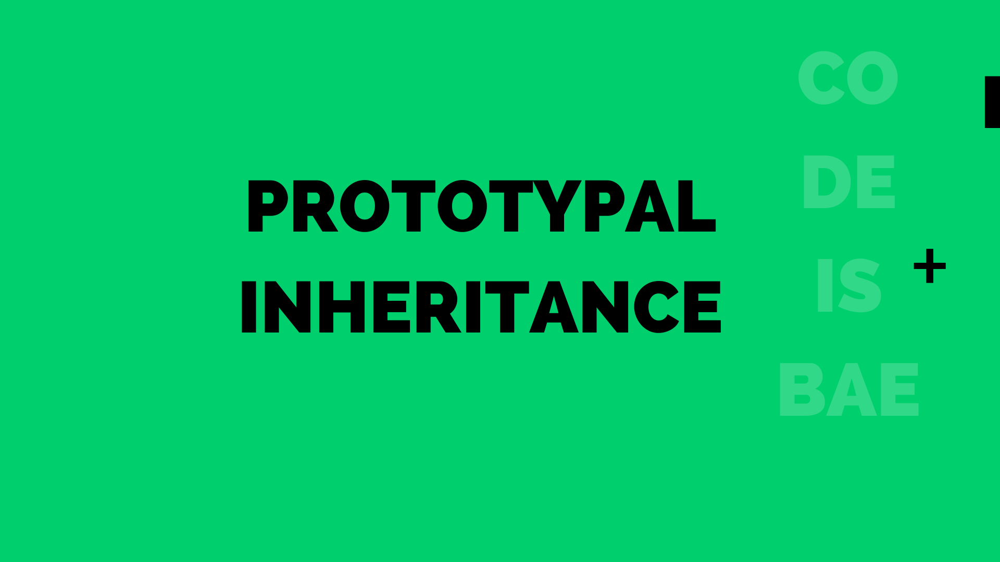

Prototypal inheritance is one of the core concepts in JavaScript. It provides the base on which other JavaScript concepts such as classes are built upon.
To allow for this method of inheritance, every JavaScript object has a private property which holds a reference to another object referred to as its `prototype` which forms a chain of properties called the `prototype chain`.
This chain of properties terminates at `null` which is considered the base of the prototype chain as it has no further reference.

### Why would you use Prototypal Inheritance
In programming, we often want to extend a functionality without re-creating it from the scratch. In such scenarios, prototypal inheritance comes in handy by allowing us build on top of our existing implementation. We will take a practical look at an example in a moment.

### How does Prototypal Inheritance Work
We've already established that JavaScript objects hold a reference to a prototype object. When we attempt to access a property in a given object, if that property exists, it is simply returned, if not, we continue a lookup on the prototype chain 
to see if it exists until we reach the end of the chain. Let's look at an example of creating an object and navigating through its prototype chain:

```js
// create animal object
let Animal = funtion() {
  this.eats = true,
}

let Cat = new Animal(); // { eats: true }

// add a new property to the Animal function's prototype
Animal.prototype.sleeps = true;

/* Access 'eats' property in `Cat`
  - check if 'eats' is a property in Cat and return the value
*/
console.log(Cat.eats); 

/* Access 'sleeps' property in `Cat`, if not available, check its prototype
  - check if 'sleeps' is a property in Cat, no it is not, check the prototype
  - check if 'sleeps' is in Cat.[[Prototype]], yes it is, return the value
*/
console.log(Cat.sleeps)

/* Access 'hasScales' in `Cat`
 - check if 'hasScales' exists in Cat, no it is not, check the prototype
 - check if 'hasScales' is in Cat.[[Prototype]], no it is not, continue checking its prototype chain
 - check if 'hasScales' is in Cat.[[Prototype]].[[Prototype]] (equivalent to Object.prototype), not found
 - continue check, Cat.[[Prototype]].[[Prototype]].[[Prototype]] is `null`, terminates
- property not found, return `undefined`
*/
console.log(Cats.hasScales)
```

### Conclusion
JavaScript objects have a hidden property called prototype, `[[Prototype]]`, which allows us take advantage of inheritance. This property defaults to `null` or could reference another object.
Because this is an internal/hidden property, this means that when we access an object, it is not available. But, JavaScript offers a special way to interact with it using `Object.getPrototypeOf()` as recommended by <a href="https://tc39.es/ecma262/#sec-object.getprototypeof" target="_blank" rel="nofollow">ECMAScript ↗︎</a>. There is also a non-official way of accessing the prototype of an object using `__proto__`. Note that this approach is deprecated and no longer recommended - <a href="https://developer.mozilla.org/en-US/docs/Web/JavaScript/Reference/Global_Objects/Object/proto" target="_blank" rel="nofollow">read more ↗︎</a>.
