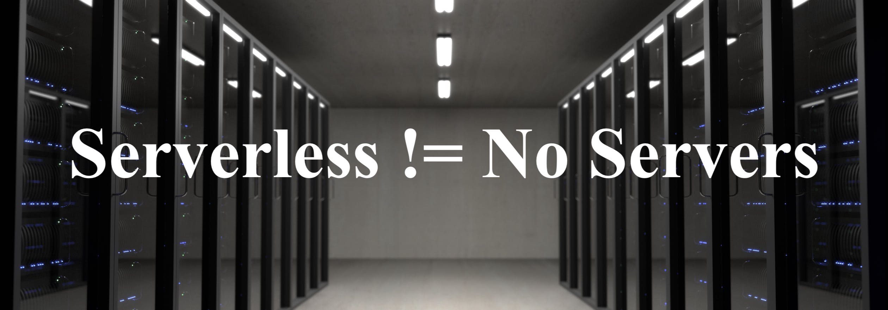

### Content

- [What is serverless computing?](#serverless)
- [Advantages of serverless and why you should consider it](#serverless-advantages)
- [Disadvantages of serverless](#serverless-disadvantages)
- [Top serverless cloud providers](#providers)
- [Open source serverless platforms](#open-source)

###  What is serverless computing?

> ### Serverless computing is a method of providing backend services on an as-used basis - Cloudflare

This simply means that with serverless, you have a cloud vendor that manages and allocates resources on the server on which your application runs. This has a whole lot of benefits as you build for the next billion users, which we would go over shortly.

### Serverless != No Servers

It’s important to clarify here that serverless does not mean there are no servers. Actually, there are physical servers on which your application runs. But you as the developer do not need to worry about setting up the server, uptime and downtime and management of server resources. These are handled by the cloud provider you are using.

###  What are the advantages of serverless and why should you consider it?

#### Money savings

You only pay for execution duration. This means that you are not paying for unused space or idle CPU time when the application is not handling any requests. Performance optimizations you make to your code will increase the speed of your app and help you save more.

#### Autoscaling

Serverless computing gives you the benefit of flexible scaling that is managed by your provider. This means that if you have an app that runs periodically, say for a few minutes every hour and only handles a few requests. During your peak business period, you might experience an increase in traffic to that app, your cloud provider auto scales the infrastructure on which your code runs to accommodate the increased request.

#### Increased productivity and time to market

With FaaS, which is a part of serverless, you can cut down time to market. How does this work? FaaS, as the name implies, is basically a function that gets triggered by an event. This event could be a user sign up, a purchase on your app, file upload, changes to database records or some other custom event you specified. The focus with FaaS is for you to build your applications faster by focusing on writing code that responds to events instead spending time on managing the infrastructure on which your code runs.

#### High availability

With serverless, you enjoy the benefits of high availability and fault tolerance out of the box. This is handled by your cloud provider. Most providers promise you an uptime that is about 99%. This means that you can have a certain level of confidence that your app would always be available when needed.

#### Zero administration

Deploy your code without worrying about provisioning, managing, or upgrading servers. The cloud provider takes care of everything required to get the application up and running.

###  What are the disadvantages of serverless?

#### Vendor lock-in

Having a third party vendor manage your infrastructure means that you do not have fine-grained control over the environment where your application is running. This could pose significant challenges during migration, which could be migrating from one vendor to another or migrating your technology stack.

#### Cold start

For applications that require low-latency, serverless might not give you the best performance - Cold start means that a system has just been created or restarted and is not yet offering peak performance.

#### Debugging

Debugging serverless applications can be difficult because the code environment is managed by a third party vendor - debugging a serverless application can be challenging and there are a couple of reasons for this. Because the environment where you code is running is managed by a third party, that makes it more difficult to add debuggers to your code as you would in a traditional application. This is an area that is currently being improved upon. And, some providers offer command line tools which give you a bit more control over your serverless applications but this still has its shortcomings.

###  Top Serverless Cloud Providers:

- **Amazon** - AWS Lambda
- **Microsoft** - Microsoft Azure Functions
- **Google** - Google Cloud Functions

### Who is using serverless computing

- <a href="https://aws.amazon.com/solutions/case-studies/finra-data-validation/" target="_blank" rel="nofollow">FINRA</a> - uses serverless to Perform 500 Billion Validation Checks Daily
- <a href="https://twitter.com/sallamar/status/927902060040908801" target="_blank" rel="nofollow">Expedia</a> - 6.2 billion requests a month on lambda
- <a href="https://aws.amazon.com/blogs/aws/things-go-better-with-step-functions/" target="_blank" rel="nofollow">The Coca-Cola Company</a>
- <a href="https://aws.amazon.com/solutions/case-studies/netflix-and-aws-lambda/" target="_blank" rel="nofollow">Netflix</a>
- <a href="https://aws.amazon.com/solutions/case-studies/autodesk-serverless/" target="_blank" rel="nofollow">Autodesk</a>

###  Open Source Serverless Platforms

- <a href="https://github.com/apache/openwhisk" target="_blank" rel="nofollow">Apache OpenWhisk ↗︎</a>
- <a href="https://github.com/fission/fission" target="_blank" rel="nofollow">Fission ↗︎</a>
- <a href="https://github.com/iron-io/functions" target="_blank" rel="nofollow">IronFunctions ↗︎</a>
- <a href="https://github.com/kubeless/kubeless" target="_blank" rel="nofollow">Kubeless ↗︎</a>
- <a href="https://github.com/openfaas/faas" target="_blank" rel="nofollow">OpenFaaS ↗︎</a>

### Resources

- https://www.cloudflare.com/learning/serverless/glossary/function-as-a-service-faas/
- https://aws.amazon.com/serverless
- https://martinfowler.com/articles/serverless.html
- https://en.wikipedia.org/wiki/Serverless_computing
- https://opensource.com/article/18/11/open-source-serverless-platforms

If you found this post helpful, be sure to share it with your team! ❤️

  <small>
    Note: you can find conference slides about this post <a href="https://speakerdeck.com/fuchodeveloper/serverless-computing" target="_blank" rel="nofollow">here ↗︎</a>
  </small>
