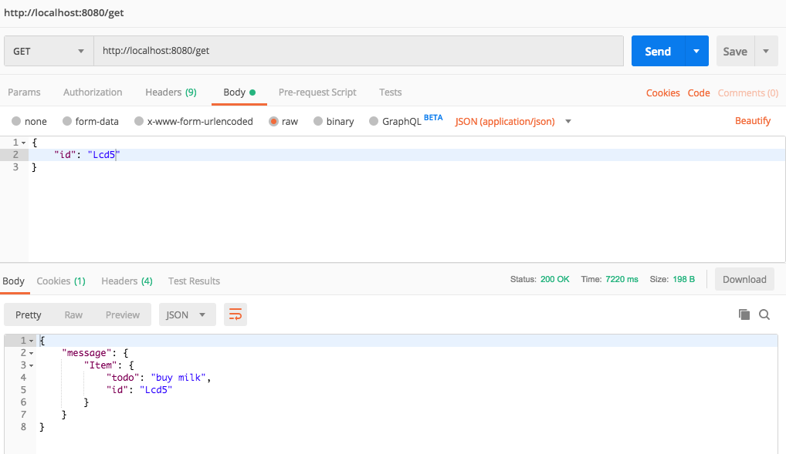
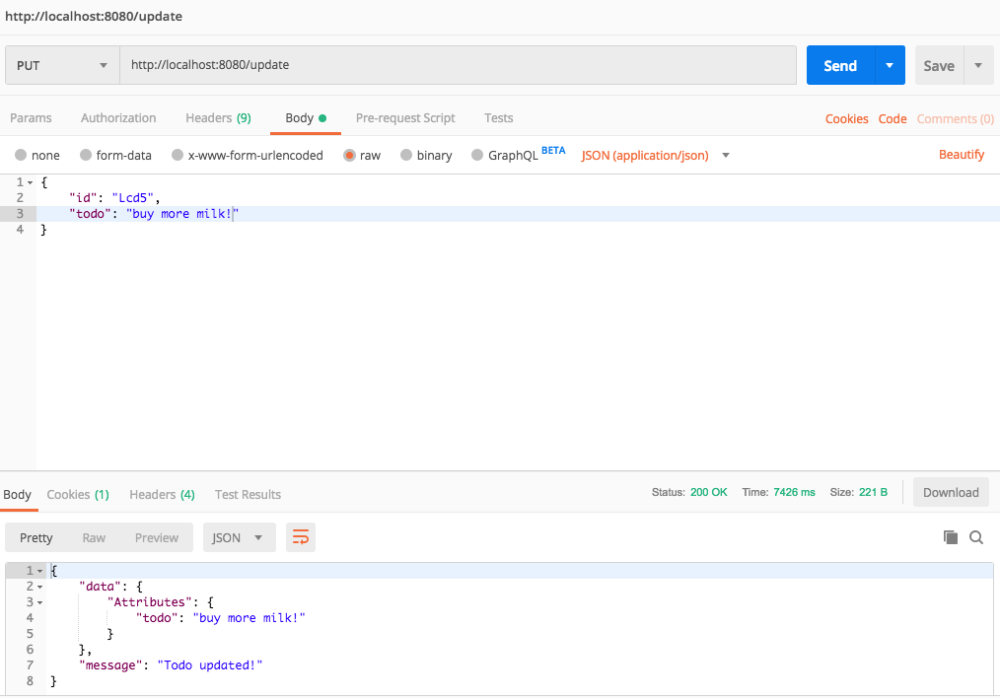
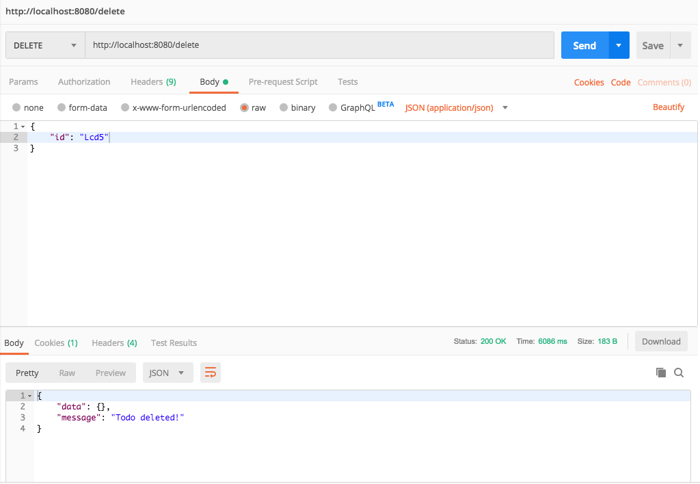

<em><small>Photo by Manuel Geissinger from Pexels</small></em>

### Introduction
Serverless applications simply refers to applications built on top of server infrastructure managed by a third party. This means that you do not have to worry about how to provision, scale or maintain the servers on which your application runs. The management is handled by the provider, which could be <a href="https://aws.amazon.com/" target="_blank" rel="nofollow">Amazon (AWS)</a>, <a href="https://azure.microsoft.com/" target="_blank" rel="nofollow">MicroSoft (Azure)</a> or <a href="https://cloud.google.com/" target="_blank" rel="nofollow">Google (Google Cloud)</a>.

**Application Architecture**

In this article, we would build a personal Todo application using the Amazon Web Services (AWS) platform. There are alternative ways to achieve the same result using frameworks such as <a href="https://serverless.com" target="_blank" rel="nofollow">Serverless</a>. Some of the AWS services we would make use of include:
- AWS Lambda
- API Gateway
- Amazon DynamoDB

**Prerequisites:**

The technology stack we would use in building our application would require:

- Working knowledge of React, Node.js
- AWS account*
- Text editor e.g Visual Studio Code
- Docker
- Local instance of DynamoDB. See &rarr; <a href="https://docs.aws.amazon.com/amazondynamodb/latest/developerguide/DynamoDBLocal.html" target="_blank" rel="nofollow">Setting Up DynamoDB Local (Downloadable Version)</a>
- <a href="https://docs.aws.amazon.com/serverless-application-model/latest/developerguide/serverless-sam-cli-install.html" target="_blank" rel="nofollow">AWS SAM CLI</a>

<small>
<em>*You might get billed while building this project if you're not on the <a href="https://aws.amazon.com/free/" target="_blank" rel="nofollow">AWS Free Tier</a>
</em>
</small>

_Code repository: https://github.com/fuchodeveloper/serverless-todo-application_

### Getting Started

We would follow a design approach of building out the backend of our application before working on the frontend. This would be a two part series, the backend would be in this post, while the frontend would be in another article.

Start by creating a new directory in your local machine using the terminal and open the directory using your favorite editor. This is where we would spend the most part of this article.

```
$ mkdir serverless-todo-backend
$ cd serverless-todo-backend
```

**Dependencies**

Let's initialise the project directory as an npm package and install the needed dependencies. Adding the `y` flag accepts defaults for all the package configs:

```sh
$ npm init -y
$ npm install aws-sdk short-unique-id
```

### Create Lambda Backend API Using SAM CLI

In this section, we would make use of the SAM CLI tool to handle the serverless resources used for our backend, which are: AWS Lambda, API-Gateway and DynamoDB. If you have not installed and setup the CLI, this would be a great time to do so. 

In the project root directory, create a new file `template.yaml` and paste the code below:
```yaml
AWSTemplateFormatVersion : '2010-09-09'
Transform: AWS::Serverless-2016-10-31

Globals:
  Function:
    Runtime: nodejs8.10
    Timeout: 180

Resources:
  CreateTodoFunction:
    Type: AWS::Serverless::Function
    Properties:
      Handler: src/index.handler
      Events:
        CreateTodo:
          Type: Api
          Properties:
            Path: /create
            Method: post
```
The `YAML` file above is a <a href="https://docs.aws.amazon.com/AWSCloudFormation/latest/UserGuide/gettingstarted.templatebasics.html" target="_blank" rel="nofollow">CloudFormation</a> template which is used to declare the AWS resources we want to create and configure. When a post request is made to `/create` on our API, the `CreateTodoFunction` would process the request and create a new Todo.

Next, in the root directory, create a new directory `src`, inside it, create `createTodo.js` and paste the code below:
```js
exports.handler = async function (event, context) {
  let response;
  try {
    response = {
      'statusCode': 200,
      'body': JSON.stringify({
        message: 'hello world',
      })
    }
  } catch (err) {
    console.log(err);
    return err;
  }

  return response
}
```
Test the simple Lambda above by running the command below in a terminal opened in the project directory:
```sh
$ sam local start-api -p 8080
```
Using Postman, make a `post` request to http://localhost:8080/create. The output should be a message like so:
```json
{
    "message": "hello world"
}
```

Give yourself a little pat on the back because we're making progress 😀.


**Setup Database**

Let's start by setting up our database table to store the todos. For this, we would use the local AWS DynamoDB instance for development and transition to a remote database later for production. 

In the project root, create a file named `connection.js` which would expose the database connection. Paste the code below in the file:
```js
const AWS = require("aws-sdk");

AWS.config.update({
  region: "us-east-1",
  endpoint: "http://localhost:8000"
});

module.exports = { AWS };
```

In order to run the DynamoDB successfully locally, we need to use the command below to run it as a docker image in a new terminal window:
```sh
 $ docker run -p 8000:8000 amazon/dynamodb-local
```

In the root directory, create a new file `createTable.js`. This would be used to create a table to hold our Todos. Paste the following in the file:
```js
const { AWS } = require('./connection');

const dynamodb = new AWS.DynamoDB();

const params = {
  TableName: "Todos",
  KeySchema: [
    { AttributeName: "id", KeyType: "HASH" },  //Partition key
  ],
  AttributeDefinitions: [
    { AttributeName: "id", AttributeType:"S" },
  ],
  ProvisionedThroughput: {
    ReadCapacityUnits: 10,
    WriteCapacityUnits: 10
  }
};

dynamodb.createTable(params, function (err, data) {
  if (err) {
    console.error("Unable to create table. Error JSON:", JSON.stringify(err, null, 2));
  } else {
    console.log("Created table. Table description JSON:", JSON.stringify(data, null, 2));
  }
});
```
Execute the program on the terminal by running: `node createTable.js`.

What the heck is happening up there? We created a table called `Todos` in Amazon DynamoDB using the values specified in the `params` object. This is made possible because we already have a database connection running on the endpoint: `"http://localhost:8000"`.

### Perform Basic Operations
Now we have our `Todos` table setup, let's make use of it for creating, reading, updating and deleting Todos. 

**1. Create a New Todo**

Before creating a Todo, one important step would be to update the DynamoDB endpoint in `connection.js` to the following:
```js
...
AWS.config.update({
  region: "us-east-1",
  endpoint: "http://docker.for.mac.localhost:8000"
});
...
```
I explained the reason for this behavior in the post &rarr; [Run DynamoDB Locally](https://www.codeisbae.com/dynamodb-local/).

Paste the following in `src/createTodo.js`:
```js
const ShortUniqueId = require('short-unique-id');
const { AWS } = require('../connection');

const docClient = new AWS.DynamoDB.DocumentClient();
const uid = new ShortUniqueId();

exports.handler = async function (event, context) {
  let response;
  let todoId = uid.randomUUID(4); // unique string of length 4
  let todoBody;
  const table = "Todos";

  if (event.body) {
    let body = JSON.parse(event.body);
    todoId = todoId;
    todoBody = body.todo;
  }

  console.log('todoId', todoId);
  const params = {
    TableName: table,
    Item: {
      "id": todoId,
      "todo": todoBody
    }
  };

  try {
    const data = await docClient.put(params).promise();
    response = {
      'statusCode': 200,
      'body': JSON.stringify({
        message: 'Todo created'
      })
    }
  } catch (err) {
    response = {
      'statusCode': 400,
      'body': JSON.stringify({
        message: 'An error occurred. Todo not created. Try again!',
      })
    }
  }

  return response;
};
```

In Postman, make a `post` request to `http://localhost:8080/create` with the body like so:
```json
{
  "todo": "buy milk"
}
```
If todo was created successfully, you should get the message below:
```json
{
  "message": "Todo created"
}
```
You're doing great!👏🏼👏🏼👏🏼

**2. Read a Todo**

Let's attempt to read/get the single todo we created above. For this, update the `template.yml` file to reflect the new function we would add to get a Todo. The updated file should look like so: 
```yaml
AWSTemplateFormatVersion : '2010-09-09'
Transform: AWS::Serverless-2016-10-31

Globals:
  Function:
    Runtime: nodejs8.10
    Timeout: 180

Resources:
  CreateTodoFunction:
    Type: AWS::Serverless::Function
    Properties:
      Handler: src/createTodo.handler
      Events:
        CreateTodo:
          Type: Api
          Properties:
            Path: /create
            Method: post

  GetTodoFunction:
    Type: AWS::Serverless::Function
    Properties:
      Handler: src/getTodo.handler
      Events:
        GetTodo:
          Type: Api
          Properties:
            Path: /get
            Method: get
```

Proceed to create a new file `getTodo.js` in `src` and paste the following code in it:
```js
const { AWS } = require('../connection');

const docClient = new AWS.DynamoDB.DocumentClient();

exports.handler = async function (event, context) {
  let response;
  let todoId;
  const table = "Todos";

  if (event.body) {
    let body = JSON.parse(event.body);
    todoId = body.id;
  }

  const params = {
    TableName: table,
    Key: {
      "id": todoId,
    }
  };

  try {
    const data = await docClient.get(params).promise();
    response = {
      'statusCode': 200,
      'body': JSON.stringify({
        message: data,
      })
    }
  } catch (err) {
    response = {
      'statusCode': 400,
      'body': JSON.stringify({
        message: err,
      })
    }
  }

  return response;
}
```
In the above code, we are retrieving a single Todo based on its `id`. If the Todo is found successfully, we return a JSON object containing the Todo, else an empty object is returned if it is not found. If an error is encountered in the operation, we return the error object. This could be further optimised so we return a custom error message, but you could do that as needed. The output should look like so on Postman:

*Output screenshot*

**3. Update a Todo**

To perform an update operation, create a new file `src/updateTodo` with the following content:
```js
const { AWS } = require('../connection');

const docClient = new AWS.DynamoDB.DocumentClient();

exports.handler = async function (event, context) {
  let response;
  let todoId;
  let todoBody;
  const table = "Todos";

  if (event.body) {
    let body = JSON.parse(event.body);
    todoId = body.id;
    todoBody = body.todo;
  }
  
  // Update the item, unconditionally,
  const params = {
    TableName: table,
    Key: {
      "id": todoId,
    },
    UpdateExpression: "set todo = :t",
    ExpressionAttributeValues: {
      ":t": todoBody
    },
    ReturnValues: "UPDATED_NEW"
  };

  try {
    const data = await docClient.update(params).promise();
    response = {
      'statusCode': 200,
      'body': JSON.stringify({
        data,
        message: 'Todo updated!'
      })
    }
  } catch (err) {
    response = {
      'statusCode': 400,
      'body': JSON.stringify({
        error: err,
        message: 'Todo not updated!'
      })
    }
  }

  return response;
};

```

In the code above, `UpdateExpression` is used to describe the update we want to perform on the Todo. `ExpressionAttributeValues` specifies what the new value would be, while `ReturnValues` parameter ensures DynamoDB returns the updated changes.

Update the `template.yml` file with the changes below:
```yaml
...

  UpdateTodoFunction:
    Type: AWS::Serverless::Function
    Properties:
      Handler: src/updateTodo.handler
      Events:
        UpdateTodo:
          Type: Api
          Properties:
            Path: /update
            Method: put

```

Make a `put` request in Postman to `http://localhost:8080/update` specifying the request body as shown in the screenshot below.

The output after running the update should look like so:
*Output screenshot*

**3. Delete a Todo**

Create a new file `src/deleteTodo.js` to handle deleting a Todo. Deletes are done using the `delete` method and specifying the primary key of the Todo. We would need to include the delete function in the `template.yml` file immediately after the `UpdateTodoFunction` section like so:

```yaml
...

  DeleteTodoFunction:
    Type: AWS::Serverless::Function
    Properties:
      Handler: src/deleteTodo.handler
      Events:
        DeleteTodo:
          Type: Api
          Properties:
            Path: /delete
            Method: delete

```

Paste the code below in `src/deleteTodo.js`:
```js
const { AWS } = require('../connection');

const docClient = new AWS.DynamoDB.DocumentClient();

exports.handler = async function (event, context) {
  let response;
  let todoId;
  const table = "Todos";

  if (event.body) {
    let body = JSON.parse(event.body);
    todoId = body.id;
  }
  
  // delete the item, unconditionally,
  const params = {
    TableName: table,
    Key: {
      "id": todoId,
    }
  };

  try {
    const data = await docClient.delete(params).promise();
    response = {
      'statusCode': 200,
      'body': JSON.stringify({
        data,
        message: 'Todo deleted!'
      })
    }
  } catch (err) {
    response = {
      'statusCode': 400,
      'body': JSON.stringify({
        error: err,
        message: 'Todo not deleted!'
      })
    }
  }

  return response;
};
```

After successfully deleting a Todo, the response should be similar to the Postman output below:
*Output screenshot*

**Going further**

Delete table - to delete the Todo table, you could follow the steps outlined in the <a href="https://docs.aws.amazon.com/amazondynamodb/latest/developerguide/GettingStarted.NodeJs.05.html" target="_blank" rel="nofollow">Amazon DynamoDB documentation</a>.

Do leave a comment if you were able to replicate the steps here or you ran into any issues 🥂.