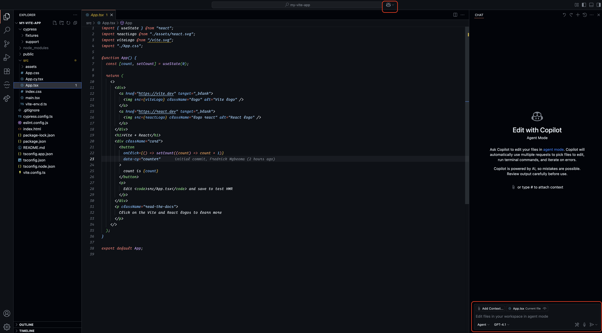
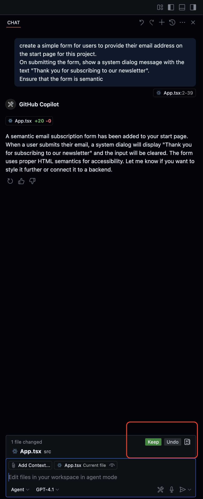
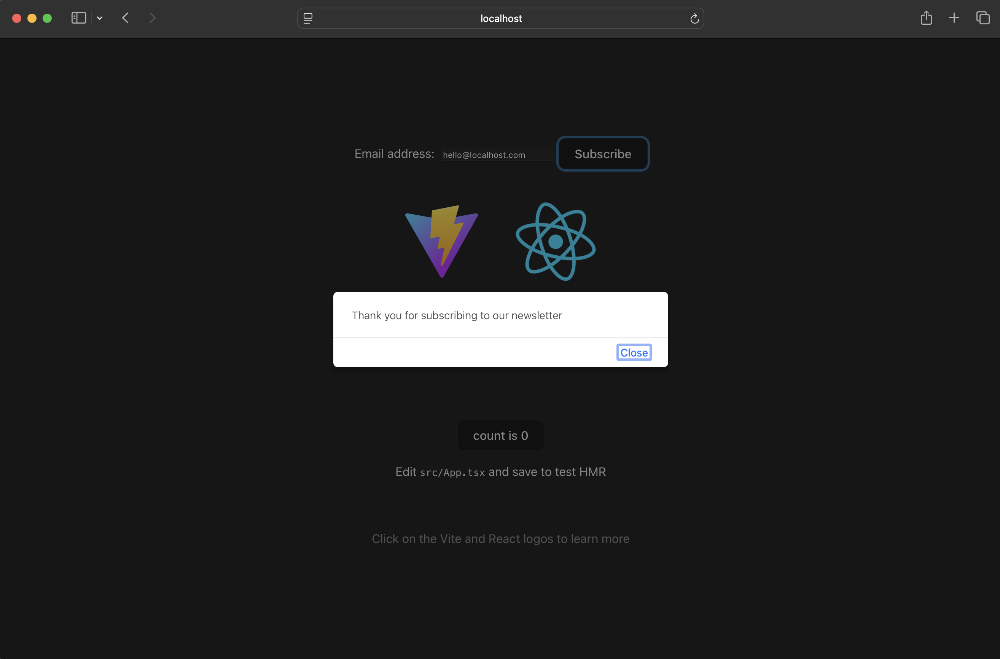

**Introduction**

Agent Mode is the latest addition to GitHub AI Copilot system which allows you to autonomously and in realtime perform complex coding tasks using natural-language prompts. Basically, it promises to be your AI coding buddy or [Rubber Duck](https://en.wikipedia.org/wiki/Rubber_duck_debugging) allowing you to develop your application faster while keeping you in control throughout the whole process.

Having used the Copilot code completion and other previous features in the past, I was of course curious to give the Agent Mode a try and see what it feels like working with it on a side project.

**How it Works**

When you use Copilot in Agent Mode, here’s what happens behind the scenes:

1. You describe the task – Simply tell Copilot what you want to achieve using natural language and adding as much context as possible depending on your use case. 
2. Problem solving approach – It interprets your request, consults the AI model, and determines the steps needed to solve the problem. You can also choose the model you prefer to use based on the problem you're solving
3. Execution – Copilot begins working through the task, writing or modifying code as needed
4. Solution iteration – If issues arise, Copilot analyzes the errors and attempts to fix them autonomously
5. Automation – Throughout the process, it uses various tools in your project e.g linters, package managers, and test runners etc to deliver a working solution

**Practical Example: Creating a newsletter subscription form using AI Agent Mode**

To keep this introductory post simple and easy to digest, we'll be use Agent Mode to review a project I created and add a form for users to provide their email address in order to subscribe to our newsletter publication. The project was created using React and [Vite](<>) but the details are not relevant to note here so let's focus only on the form creation.

**Pre-requisites:**

* GitHub Copilot Pro subscription
* A supported IDE (for instance VS Code, JetBrains, Eclipse etc)

**Step-by-Step Walkthrough**

1. Activate AI Agent Mode

If using VS Code, click on the Copilot icon on the VS Code menu bar or toggle the Secondary Side Bar. For the best results, ensure that the file you want to work on is already open in the editor view to give Copilot more context on what you're working on. This is not compulsory but because Large Language Models (LLMs) need as much accurate information as possible to produce better results, this is advisable. See screenshot below:

2. Execution Process

Enter the following task on the opened side bar chat window: Give the Agent a task: 

`create a simple form for users to provide their email address on the start page for this project.
On submitting the form, show a system dialog message with the text "Thank you for subscribing to our newsletter".
Ensure that the form is semantic`

During execution of the task, you need to manually confirm the various changes made by the Copilot by click on "Continue", if needed or you can accept the changes by clicking on the "Keep" button. An example is show below:

The final result of the generated code on the UI looks like so:

**Conclusion**

Using GitHub Copilot Agent Mode, we were able to quickly build a simple newsletter subscription form—no manual setup, no boilerplate. This highlights how Agent Mode can streamline everyday tasks and scale to more complex jobs like building out full features for your application based on the provided functional specification or design. It's safe to say that GitHub Copilot with Agent Mode is a smart tool to keep in your toolkit for modern software development.

Try it out and see how much time you can save on your next project!

**Resources / Further Reading**

* https://github.blog/ai-and-ml/github-copilot/agent-mode-101-all-about-github-copilots-powerful-mode/
* https://github.blog/developer-skills/github/less-todo-more-done-the-difference-between-coding-agent-and-agent-mode-in-github-copilot/
